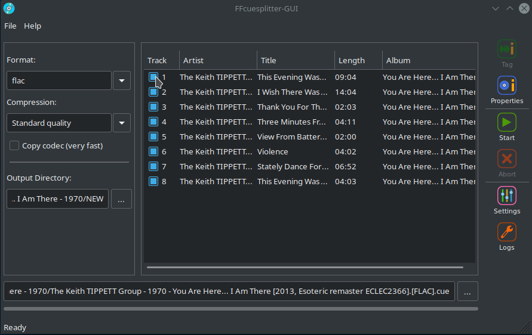

[](https://www.python.org/downloads/)
[](https://github.com/jeanslack/FFcuesplitter-GUI/blob/main/LICENSE)

# FFcuesplitter-GUI 

A simple graphical user interface to extracts audio tracks from audio CD images 
supplied with a CUE sheet.



## Description

FFcuesplitter-GUI is a cross-platform GUI written in wxPython Phoenix. It is 
based on the [FFcuesplitter](https://github.com/jeanslack/FFcuesplitter) library, 
which is based on FFmpeg for audio track extraction and encoding processes.
It features editable tags per track, an audio CD properties viewer, support for 
WAV, FLAC, MP3, OGG, OPUS output formats, audio compression selectors and the 
ability to copy audio codec without re-encoding.

## Requirements
- **[Python >= 3.7.0](https://www.python.org/)**
- **[wxPython-Phoenix >= 4.0.7](https://wxpython.org/)**
- **[PyPubSub >= 4.0.3](https://pypi.org/project/PyPubSub/)**
- **[ffcuesplitter >= 1.0.22](https://pypi.org/project/ffcuesplitter/)**
- **[ffmpeg >=4.3](https://ffmpeg.org/)**
- **[ffprobe >=4.3](https://ffmpeg.org/ffprobe.html)**

## Running from source code

```
git clone https://github.com/jeanslack/FFcuesplitter-GUI.git
cd FFcuesplitter-GUI
python3 -m venv My_env
source My_env/bin/activate
python3 -m pip install -r requirements.txt
python3 launcher
```

## Authors
See [AUTHORS](AUTHORS) file

## License
The [GNU GENERAL PUBLIC LICENSE Version 3](LICENSE)
